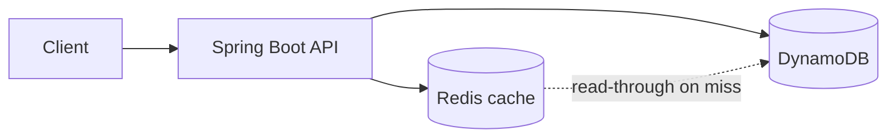

# URL Shortener

Public, anonymous URL shortening service designed for **low-latency redirects**, **durable mappings on DynamoDB**, and **Redis-backed caching** for hot links. Behavioural requirements and implementation tasks are captured in **OpenSpec** (`openspec/changes/dynamodb-redis-url-shortener-mvp/`).

## What it does

The service shortens long URLs into compact codes, resolves browser or API redirects to the original destination, and exposes lightweight, cost-aware analytics. It is **single-tenant**, **no authentication in MVP**, and intended to run on **AWS** (for example **ECS Fargate** in `us-east-1`) with **Amazon DynamoDB** and **ElastiCache for Redis**.

## Planned HTTP API

| Method | Path | Purpose |
|--------|------|---------|
| `POST` | `/api/v1/urls` | Create a new short mapping (always a new code, even for duplicate long URLs). |
| `GET` | `/{shortCode}` | Resolve a short code; respond with redirect or error status (see below). |
| `GET` | `/api/v1/urls/{shortCode}/analytics` | Return total clicks, last access time, and hourly buckets. |

### Redirect and error semantics

| Condition | HTTP status |
|-----------|-------------|
| Active mapping | `302 Found` with `Location: <originalUrl>` |
| Unknown code | `404 Not Found` |
| Expired mapping | `410 Gone` |
| Invalid code shape (not exactly 7 chars `[a-z0-9]`) | `400 Bad Request` |
| Custom alias already taken (on create) | `409 Conflict` |
| Rate limit exceeded | `429 Too Many Requests` |

### Short codes and aliases

- **Random codes:** 7 characters from **`[a-z0-9]`** only.
- **Custom alias:** optional; must follow the same shape; collisions return **409**.
- **Time to live:** default **30 days** per link; maximum **365 days** from creation.

### Analytics (MVP)

- **Total click count** and **last accessed** timestamp.
- **Hourly bucketed** counts, retained for **30 rolling days** (no raw per-click event store in MVP).
- Analytics may be **eventually consistent**; strict real-time reporting is not required.

### Abuse and validation

- **IP-based rate limiting** on create and redirect traffic.
- **URL validation** (allowed schemes, length, syntax).
- **Blocked domains** from **static configuration** (MVP).

## Architecture

Traffic enters a **Spring Boot** application. Writes persist to **DynamoDB** (source of truth, including TTL metadata). Reads on the redirect path use **Redis** as a **read-through cache**; on cache miss the service loads from DynamoDB and repopulates Redis. Observability uses **Micrometer** with metrics suitable for **Amazon CloudWatch**.



### NFR targets (design)

- Throughput: about **50 writes/sec** and **5,000 reads/sec**.
- Redirect latency: **p95 < 100 ms** under target load.

## Technology stack

| Layer | Choice |
|-------|--------|
| Runtime | Java **17**, **Spring Boot 4** |
| API / health | `spring-boot-starter-web`, **Spring Boot Actuator** (`/actuator/health` for load balancers) |
| Container | **Docker** (multi-stage `Dockerfile`) |
| Primary store | **Amazon DynamoDB** (PK: short code; TTL on expiry attribute) |
| Cache | **Redis** (e.g. Amazon ElastiCache) |
| Cloud | **AWS** `us-east-1`; **ECS Fargate**-compatible deployment shape |

## Local development

Prerequisites: **JDK 17**, **Gradle** (wrapper included).

```bash
./gradlew test
./gradlew bootRun
```

Health check (use **http**, not https, for local Tomcat):

```bash
curl -s http://localhost:8080/actuator/health
```

### Docker image

```bash
docker build -t url-shortener:local .
docker run --rm -p 8080:8080 url-shortener:local
```

## Specification-driven development (OpenSpec)

This repo includes an OpenSpec change with proposal, design, delta spec, and tasks:

- `openspec/changes/dynamodb-redis-url-shortener-mvp/proposal.md` — intent and scope  
- `openspec/changes/dynamodb-redis-url-shortener-mvp/design.md` — technical decisions  
- `openspec/changes/dynamodb-redis-url-shortener-mvp/specs/url-shortening/spec.md` — requirements and scenarios  
- `openspec/changes/dynamodb-redis-url-shortener-mvp/tasks.md` — implementation checklist  

## Implementation status

The application currently provides a **runnable Spring Boot** service with **Actuator health** and a **container build**, suitable for **ECS/ALB** health checks. **Core shortening, DynamoDB, Redis, and analytics** are specified in OpenSpec and listed in `tasks.md`; implement or track them as you work through **`/opsx:apply`** or your own backlog.

## Repository

- **GitHub:** [https://github.com/Srisakthi14/url-shortener](https://github.com/Srisakthi14/url-shortener)
