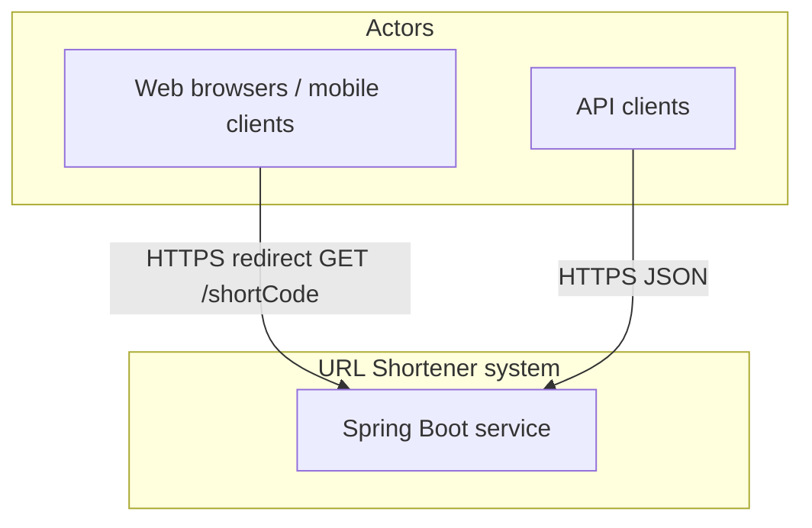
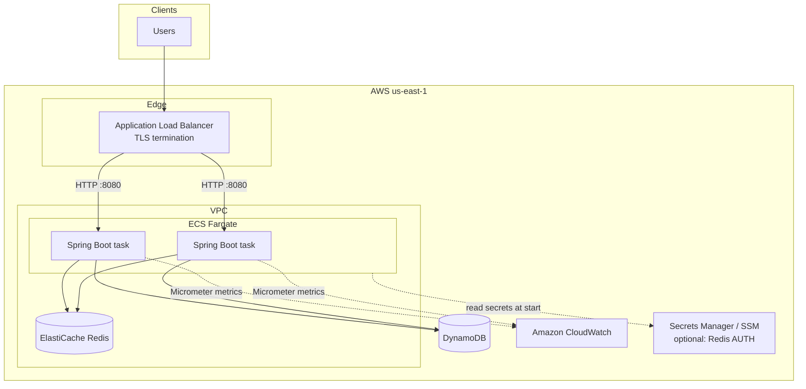
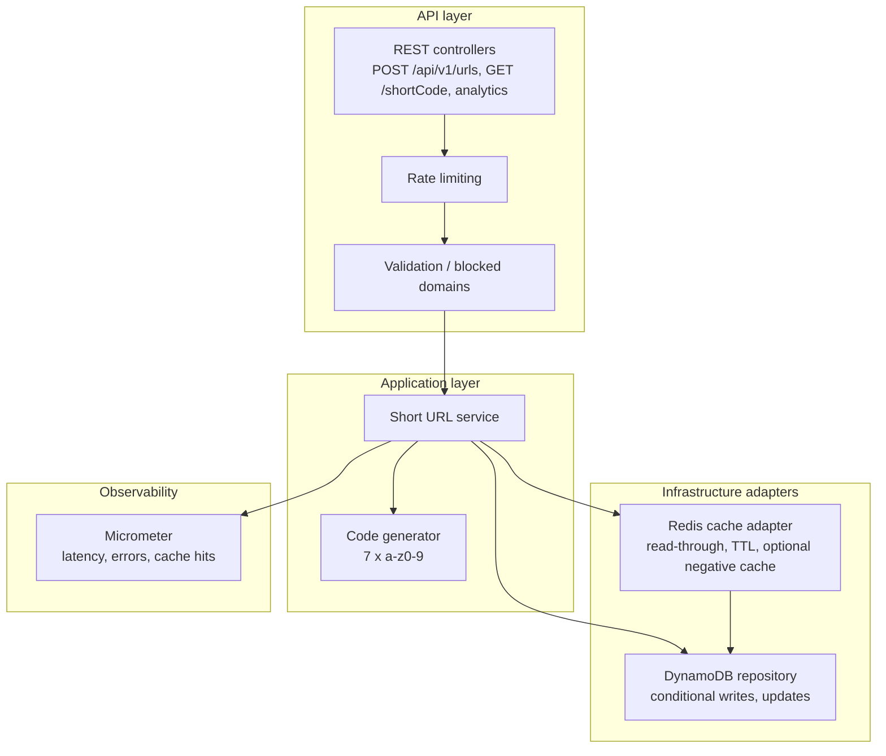
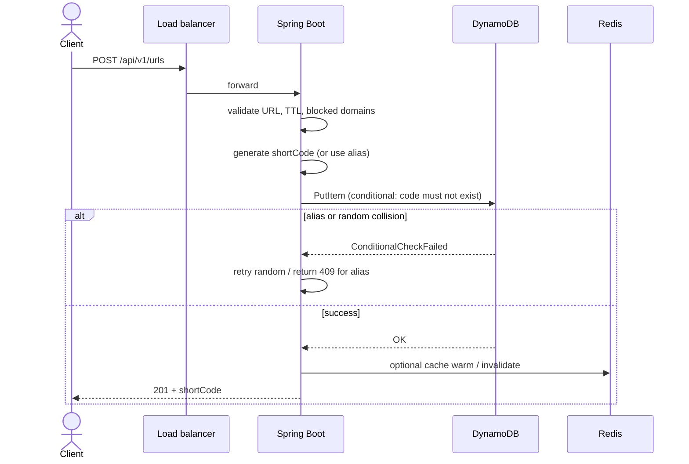
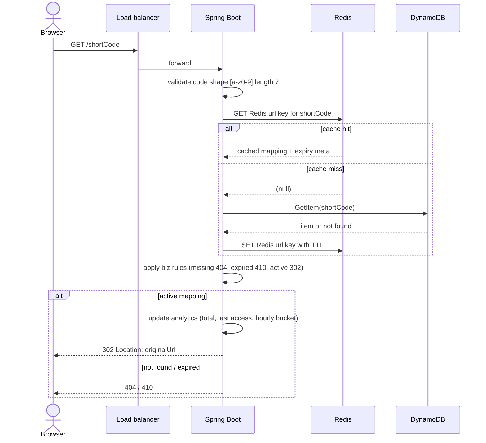
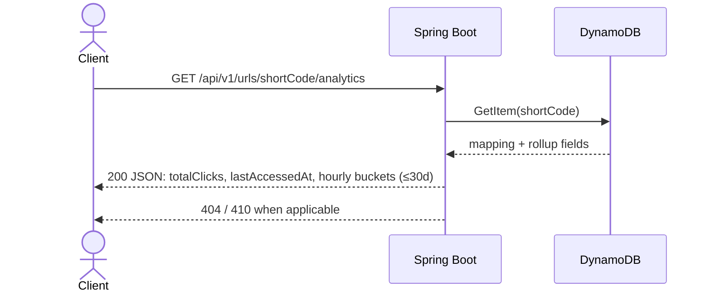

# URL Shortener — Architecture & Design Diagrams

This document describes the **target** architecture for the MVP (see [OpenSpec change](../openspec/changes/dynamodb-redis-url-shortener-mvp/) for requirements). Diagrams use [Mermaid](https://mermaid.js.org/) and render on GitHub.

---

## 1. System context

External actors and the single deployable system boundary.

---

## 2. AWS deployment (ECS Fargate)

Reference layout for **`us-east-1`**: TLS at the load balancer, tasks in a VPC, regional DynamoDB, Redis in-VPC.

**Security groups (typical):**

- ALB: allow `443` (and optionally `80`) from the internet or your edge.
- ECS tasks: allow app port from **ALB SG** only; allow **outbound** to DynamoDB (via IGW/NAT or gateway endpoint) and to **Redis SG** on `6379`.
- Redis: allow **6379** from **ECS task SG** only.

---

## 3. Logical components (inside the service)

Responsibilities layered for clarity; exact package names may differ in code.

---

## 4. Data flow — create short URL

---

## 5. Data flow — redirect (cache read-through)

---

## 6. Data flow — analytics read

---

## 7. DynamoDB item (conceptual)

Single-table style MVP: **partition key** = `shortCode` (String). Attributes are illustrative; names may be adjusted in implementation.

| Attribute | Role |
|-----------|------|
| `shortCode` | PK |
| `originalUrl` | Redirect target |
| `createdAt` | Audit |
| `expiresAt` | App-level `410` + DynamoDB TTL attribute |
| `totalClicks` | Rollup counter |
| `lastAccessedAt` | Rollup timestamp |
| `hourlyBuckets` | Map or sparse attributes; **30-day** retention policy |
| `ttl` | DynamoDB TTL epoch seconds (if named differently in console, align with app) |

---

## 8. Redis keys (conceptual)

| Key | Value | Notes |
|-----|--------|--------|
| `url:{shortCode}` | Serialized URL + expiry metadata | Read-through on redirect; bounded TTL |
| Optional `miss:{shortCode}` | Sentinel for negative caching | Short TTL to reduce DB churn |

---

## Related documents

- [README](../README.md) — product summary and API table  
- [OpenSpec design](../openspec/changes/dynamodb-redis-url-shortener-mvp/design.md) — decisions and risks  
- [OpenSpec delta spec](../openspec/changes/dynamodb-redis-url-shortener-mvp/specs/url-shortening/spec.md) — normative behaviour
